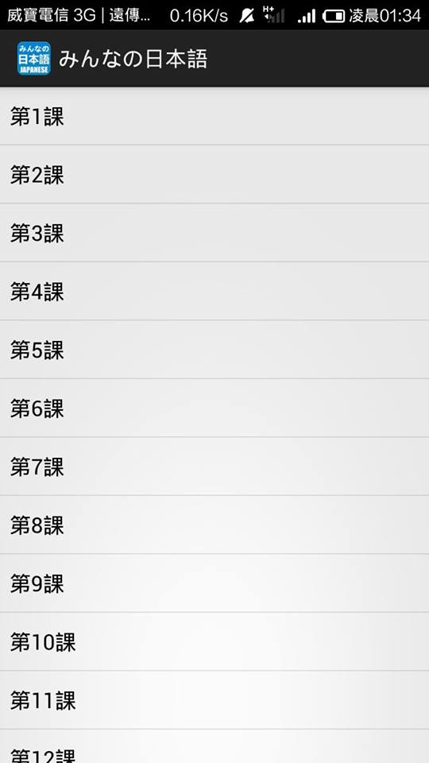
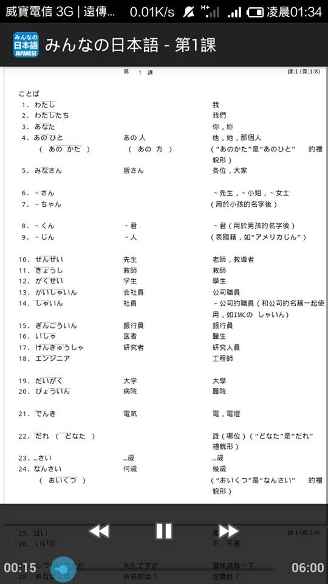

##みんなの日本語
---
###This is an Android Japanese learning app. 
###Below are snapshots of this app

---
###It contains 50 lessons of みんなの日本語.

At first I use PDFViewer sdk to display the pdf lessons. However, it turned out that the sdk seem to have some problem parsing Japanese and Chinses.
Therefore, I use WebView instead and turn all PDFs into htmls so that I can read it from WebView.

I also impliment a mediacontroller to enable user to listen to the lesson recording.

This is considered as a practice to get famillar with some Android APIs and concepts.

###Things to be improved:
- UI design
- To reduce the the .apk size (too much audio)

[みんなの日本語 Lessons PDF]( https://www.dropbox.com/sh/f3unjvmh6dmwnct/CO9TU6m31G)
 
[みんなの日本語 Apk download](https://dl.dropboxusercontent.com/u/113630504/Minna_No_Nihongo.apk)

######みんなの日本語  All Rights Reserved.
